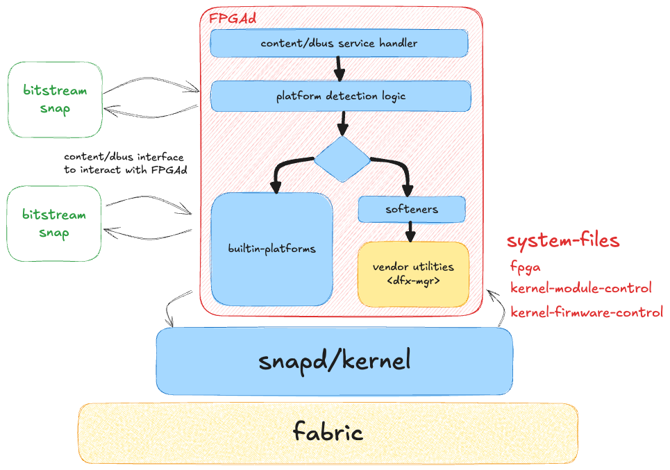

# FPGAd

[](https://snapcraft.io/fpgad)

FPGAd is a WIP rust project.
It provides a strictly confined snap which will provide a mechanism to dynamically load and unload bitstreams to FPGA
devices on Ubuntu Core.
It mitigates the need for other snaps containing bitstreams to have super privileges.
Instead, those other snaps will connect to FPGAd and FPGAd will have the necessary privileges.
This is for several reasons, but mostly to:

1. make the snap store team happy (not publishing lots of super privileged snaps).
2. add a place for checking and verifying bitstreams before loading them for additional safety/security.
3. make it easier to port already existing bitstream packages to snap store.

In order to understand why the super privileges are necessary, you must understand that loading a bitstream
fundamentally changes the FPGA device's behaviour including what the connections to the CPU are/do.
To do this, device tree of the system must be changed (overlaid).
This device tree tells Ubuntu a lot of information about the device, such as how much ram the system has.
It should be clear to see, then, that compromising the device tree is very powerful.

# Anticipated Architecture



# To Run Daemon

```shell
sudo RUST_LOG=trace RUST_BACKTRACE=full ./target/debug/fpgad
```

# Configure DBUS

```shell
sudo cp ./data/dbus/com.canonical.fpgad.conf /etc/dbus-1/system.d/
```

# To run on startup

Before installing, confirm that `ExecStart=` in the `.service` file points to the correct executable (e.g.
`ExecStart=/home/ubuntu/fpgad/target/debug/fpgad`).

To install the service run

```shell
sudo cp data/systemd/fpgad.service /lib/systemd/system/
```

To run without restarting

```shell
sudo systemctl daemon-reexec
sudo systemctl daemon-reload
sudo systemctl enable fpgad.service
sudo systemctl start fpgad.service
```

# Typical control sequence

#### FPGA only:

1. control.SetFpgaFlags(fpga_handle, flags)
2. control.WriteBitstreamDirect(fpga_handle, bitstream_path)

#### Overlay only:

1. status.GetOverlayStatus(overlay_handle) <- check doesn't exist
2. control.SetFpgaFlags(device_handle, flags) <- does check for sticking internally
3. control.CreateOverlay(overlay_handle) <- just makes a dir and checks the subsystem created the internal files
4. control.ApplyOverlay(overlay_handle, dtbo_path) <- writes dtbo_path to overlay and asserts overlay status
5. status.GetFpgaState(fpga_handle) <- check it is `operating`

#### Combined:

1. control.SetFpgaFlags(device_handle, flags) <- >does check for sticking internally
2. control.WriteBitstreamDirect
3. control.CreateOverlay(overlay_handle) <- just makes a dir and checks the subsystem created the internal files
4. control.ApplyOverlay(overlay_handle, dtbo_path) <- writes dtbo_path to overlay and asserts overlay status
5. status.GetFpgaState(fpga_handle) <- check it is `operating`

#### Removing:

The FPGA subsystem does not have a way to remove an overlay. Instead, you must write a new one.

To remove an overlay simply call:

1. control.RemoveOverlay(overlay_handle)

# Busctrl Call Examples

### Status (unprivileged)

```shell
busctl call --system com.canonical.fpgad /com/canonical/fpgad/status com.canonical.fpgad.status GetFpgaState ss "" "fpga0"

busctl call --system com.canonical.fpgad /com/canonical/fpgad/status com.canonical.fpgad.status GetFpgaFlags ss "" "fpga0"

busctl call --system com.canonical.fpgad /com/canonical/fpgad/status com.canonical.fpgad.status GetOverlayStatus ss "zynqmp-" "fpga0"

busctl call --system com.canonical.fpgad /com/canonical/fpgad/status com.canonical.fpgad.status GetPlatformType s "fpga0"

busctl call --system com.canonical.fpgad /com/canonical/fpgad/status com.canonical.fpgad.status GetPlatformTypes 

busctl call --system com.canonical.fpgad /com/canonical/fpgad/status com.canonical.fpgad.status GetOverlays
```

### Control (privileged)

```shell
sudo busctl call --system com.canonical.fpgad /com/canonical/fpgad/control com.canonical.fpgad.control SetFpgaFlags ssu "" "fpga0" 0

sudo busctl call --system com.canonical.fpgad /com/canonical/fpgad/control com.canonical.fpgad.control ApplyOverlay sss "zynqmp-" "fpga0" "/lib/firmware/k26-starter-kits.dtbo"

sudo busctl call --system com.canonical.fpgad /com/canonical/fpgad/control com.canonical.fpgad.control WriteBitstreamDirect sss "" "fpga0" "/lib/firmware/k26-starter-kits.bit.bin"

sudo busctl call --system com.canonical.fpgad /com/canonical/fpgad/control com.canonical.fpgad.control RemoveOverlay ss "zynqmp-" "fpga0" 

sudo busctl call --system com.canonical.fpgad /com/canonical/fpgad/control com.canonical.fpgad.control LoadDefaults
```

sudo busctl call --system com.canonical.fpgad /com/canonical/fpgad/control com.canonical.fpgad.control ApplyOverlay ssss "xlnx" "fpga0" "/lib/firmware/k26-starter-kits.dtbo" ""

sudo busctl call --system com.canonical.fpgad /com/canonical/fpgad/control com.canonical.fpgad.control WriteBitstreamDirect ssss "" "fpga0" "/lib/firmware/k26-starter-kits.bit.bin" ""

sudo busctl call --system com.canonical.fpgad /com/canonical/fpgad/control com.canonical.fpgad.control ApplyOverlay ssss "xlnx" "fpga0" "/lib/firmware/xilinx/k26-starter-kits/k26_starter_kits.dtbo" "/lib/firmware/xilinx/k26-starter-kits"

sudo busctl call --system com.canonical.fpgad /com/canonical/fpgad/control com.canonical.fpgad.control WriteBitstreamDirect ssss "" "fpga0" "/lib/firmware/xilinx/k26-starter-kits/k26_starter_kits.bit.bin" "/lib/firmware/"

sudo busctl call --system com.canonical.fpgad /com/canonical/fpgad/control com.canonical.fpgad.control RemoveOverlay ss "xlnx" "fpga0"
```
