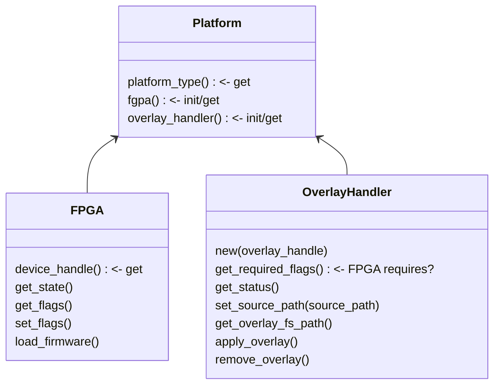
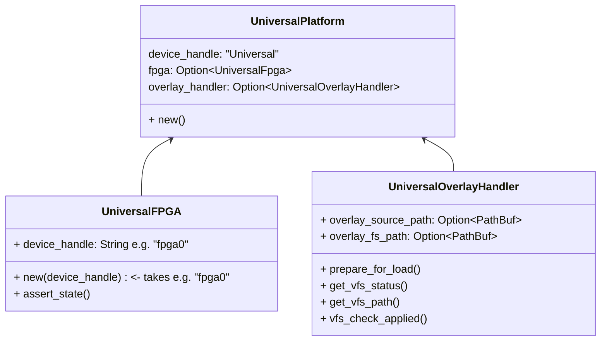

# FPGAd Platforms

- **Universal** - Only uses the linux kernel implementations for bitstream loading. Relies on linux drivers.

# Trait

```mermaid
classDiagram
    class Platform {
        platform_type() <- get
        fgpa() <- init/get
        overlay_handler() <- init/get
    }
    class FPGA {
        device_handle() <- get
        get_state()
        get_flags()
        set_flags()
        load_firmware()
    }
    class OverlayHandler {
        new(overlay_handle)
        get_required_flags() <- FPGA requires?
        get_status()
        set_source_path(source_path)
        get_overlay_fs_path()
        apply_overlay()
        remove_overlay()
    }
    Platform <-- FPGA
    Platform <-- OverlayHandler
```

# Universal

```mermaid
classDiagram
    class UniversalPlatform {
        device_handle: "Universal"
        fpga: Option&lt;UniversalFpga&gt;
        overlay_handler: Option&lt;UniversalOverlayHandler&gt;
        + new()
    }
    class UniversalFPGA {
        + device_handle: String e.g. "fpga0"
        + new(device_handle) <- takes e.g. "fpga0"
        + assert_state()
    }
    class UniversalOverlayHandler {
        + overlay_source_path: Option&lt;PathBuf&gt;
        + overlay_fs_path: Option&lt;PathBuf&gt;
        + prepare_for_load()
        + get_vfs_status()
        + get_vfs_path()
        + vfs_check_applied()
    }
    UniversalPlatform <-- UniversalFPGA
    UniversalPlatform <-- UniversalOverlayHandler


```

