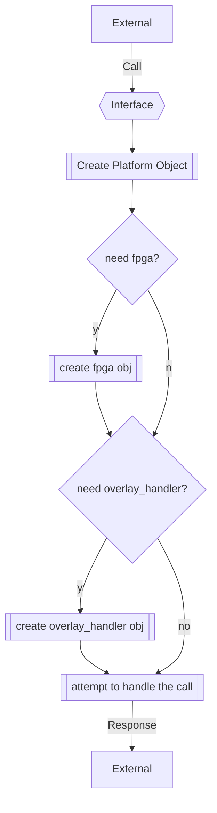

# FPGAd Communication Module

# General principle

```mermaid
flowchart TD
    A[External] -- Call --> B{{Interface}}
    B --> C[[Create Platform Object]]
    C --> D{need fpga?}
    D -- y --> E[[create fpga obj]]
    E --> F{need overlay_handler?}
    D -- n --> F
    F -- y --> G[[create overlay_handler obj]]
    G --> H[[attempt to handle the call]]
    F -- no --> H
    H -- Response --> Z[External]
```
