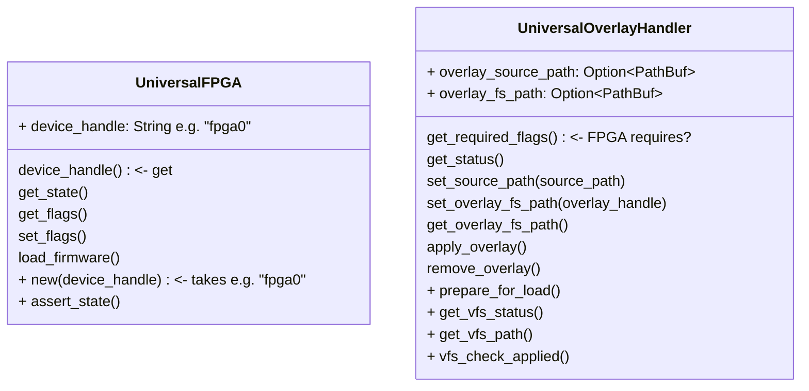

# Components for Universal Platforms

- UniversalFpga
- UniversalOverlayHandler

A UniversalFpga instance is created with a known device handle/name such as `fpga0`. The constructor will return None if
the device is not present in sysfs.

A UniversalOverlayHandler instance is created empty and must be populated with it's overlay_source_path (location of the
overlay which will be used) and overlay_fs_path (the configfs directory associated with the file in
overlay_source_path), however, here, the overlay_fs_path is constructed using a handle/name for the overlay. This is
provided by the user and, if `fpga0` is provided, becomes, for example, `/sys/kernel/config/device-tree/overlays/fpga0`.
This overlayfs base path is used to access the overlay's `path` and `status` virtual files. The implementation specific
methods `get_vfs_status()` and `get_vfs_path()` are used to read from these files. The method `vfs_check_applied()` is a
wrapper to check that both the status and path files show the correct contents after an attempted application.

